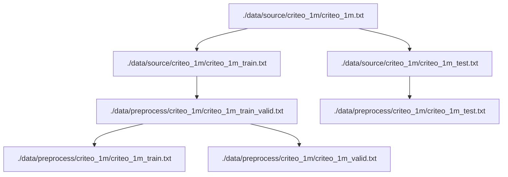

# DeepFM-re

实现了一个可以适配大规模数据和处理特征的DeepFM轮子。

## Dependencies
+ cuda == 11.3
+ cudnn == 7.6.5
+ numpy == 1.19.5
+ pandas == 1.2.0
+ python == 3.8.16
+ tensorflow == 2.6.0
+ tensorflow-gpu == 2.6.0
+ keras == 2.6.0
+ tqdm == 4.65.0

## Overview

工作中需要用到DeepFM模型，理论和代码都不算特别难，但在查阅网上资料的过程中发现它们的实现存在两个问题。

(1) 普遍使用pd.read_csv()将全部数据载入到内存中，这在大规模数据集上是不现实的，比如原始Criteo数据集包含有约4500万条点击记录，存储相关记录的txt文件已经达到12G。另外业务所使用的数据量级也都在百万条以上，在资源不足的情况下很容易就会OOM。

(2) 没有考虑模型部署后特征处理的问题。因为相关的测试集都是从原始数据上划分出来的，所以直接就把特征处理过程一并完成了。实际业务中，模型训练好之后需要进行部署，然后暴露接口给服务器，客户端发出的请求一般都是没有经过任何处理的原始数据（比如没有经过归一化处理的连续型特征或者没有经过映射的类别特征），这些特征需要经过处理之后才可以输入到模型进行推理服务。以前在学校遇到这个类似问题的时候是使用npy或者pickle的方式存储特征处理时需要用到的数据（比如归一化中的最大值/最小值，类别特征的映射表），参考[GraphSol](https://github.com/jcchan23/GraphSol)的第一版实现。

基于以上两点需求，查阅资料后在这份代码中增加了三个内容。

(1) 在pd.read_csv()中加入了chunksize参数，使得它可以分批次读取数据集。
(2) 使用了tensorflow中feature_column()的相关接口，将原来需要用npy或者pickle方式处理的数据放到了tf模型中。使得模型可以直接接受原始特征的输入，而不是经过特征处理后的输入。
(3) 使用了generator()来给模型分批次输入数据，不需要一次性全部读完所有全部数据（终于把这个在学校的时候没学会的知识点搞清楚了一些）。


## Running

想要运行代码，需要做如下准备。

(1) 下载代码

`git clone git@github.com:jcchan23/DeepFM-re.git`

(2) 找到`./data/source`文件夹，里面已经建立了`criteo_100k`，`criteo_1m`和`criteo`3个文件夹，对应着100000条，1000000条和原始criteo数据集。可以直接使用文件夹下的`download.sh`直接下载并解压对应的数据集，也可以直接使用如下链接下载。

[criteo_100k（压缩包8.4MB，解压后约24MB）](https://drive.google.com/file/d/1EtU1T0P8GT81SB04_zkingpqQlF-dWAV/view?usp=share_link)

[criteo_1m（压缩包82.8MB，解压后约230MB）](https://drive.google.com/file/d/1QrKd58Ss9yYklQ2zEt4eT2SQ11bb8mXs/view?usp=share_link)

[criteo（压缩包3.8GB，解压后约11GB）](https://drive.google.com/file/d/1mCrEqg9UJ45dKXVsmZBdmL1Xxc6BLhTM/view?usp=share_link)


(2) 运行如下命令

`python split_dataset.py criteo_100k/criteo_1m/criteo`

注意后面的参数是3个数据集选1个，默认情况它会随机抽取10%的数据作为测试集，剩下90%作为训练集，然后写成两个文件，以`criteo_1m`为例，运行后该文件下的文件如下所示。
```
.
├── criteo_1m_test.txt
├── criteo_1m_train.txt
├── criteo_1m.txt
└── download.sh

0 directories, 4 files
```

(3) 运行如下命令

`CUDA_VISIBLE_DEVICES=<gpu_id> python -u run.py config.yaml`

或者如果想后台运行并记录日志的话

`CUDA_VISIBLE_DEVICES=<gpu_id> nohup python -u run.py config.yaml > <log_name> &`

+ `<gpu id>` 是gpu id，如果没有的话可以设为-1，使用CPU来跑。
+ `<log_name>`是日志文件名，也可以自定义日志路径。 

其他参数可以参考config.yaml，注意dataset的名字要和前面切分数据集对应上，不然会提示找不到文件。

(4) 部分中间结果

代码运行过程中会产生一些中间结果，放在`./data/preprocess/<dataset_name>`下，仍以`criteo_1m`为例。
```
.
├── criteo_1m_statis_info.pickle // 特征处理需要的中间数据，非必须，因为调参时需要多次运行代码，存储起来直接读的话就不需要重新读取大规模数据集然后计算。
├── criteo_1m_test.txt           // 经过特征处理后的测试集
├── criteo_1m_train.txt          // 经过特征处理后的训练集
├── criteo_1m_train_valid.txt    // 经过特征处理后的训练集+验证集
├── criteo_1m_valid.txt          // 经过特征处理后验证集
└── README.md                    // 注释文件

0 directories, 6 files
```

其中训练集/验证集/测试集之间的关系如下，以`criteo_1m`为例。



## Result

目前得到的一个初步结果，没有进过仔细调参，供参考，其中在criteo上设置batch_size为10240，另外两个小数据集上batch_size为512。

AUC
|Method|criteo_100k|criteo_1m|criteo|
|:---: |:---:| :---:| :---:|
|DeepFM    |-|-|0.8007|
|DeepFM-re|0.7497±0.0010|0.7633±0.0008|0.7837±0.0005|

LogLoss(Binary_Crossentropy)
|Method|criteo_100k|criteo_1m|criteo|
|:---: |:---:| :---:| :---:|
|DeepFM    |-|-|0.4508|
|DeepFM-re|0.4723±0.0005|0.4845±0.0012|0.4669±0.0010|


## Reference:

1. 原始DeepFM实现：https://github.com/ChenglongChen/tensorflow-DeepFM

2. Pytorch实现：https://github.com/chenxijun1029/DeepFM_with_PyTorch

3. Tensorflow2实现：https://github.com/zxxwin/tf2_deepfm

4. Criteo数据集链接：https://www.kaggle.com/datasets/mrkmakr/criteo-dataset

